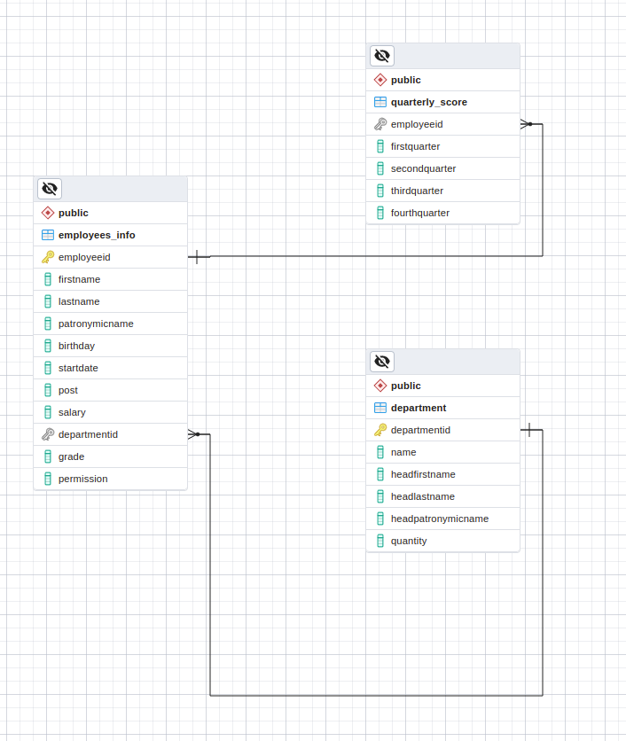

Для создания и заполнения БД согласно заданиям 1-4 необходимо выполнить команду:
```shell
docker-compose up -d
```
Формирование запросов на заполнение таблиц описано в файле `/scripts/fill_tables.sql`.

Остальные задания выполняются при помощи pgAdmin, который доступен по адресу `http://localhost:5050/browser/`.

Схема созданной БД:


*Задание 5:*
```sql
INSERT INTO department (Name, HeadFirstName, HeadLastName, HeadPatronymicName, Quantity)
VALUES ('Интеллектуальный анализ данных', 'Крючков', 'Андрей', 'Алексеевич', 3);
```
```sql
INSERT INTO employees_info (FirstName, LastName, PatronymicName, Birthday, StartDate, Post, Salary, DepartmentId, Grade, Permission)
VALUES ('Крючков', 'Андрей', 'Алексеевич', '1983-10-04', '2022-11-19', 'Department Head', 220, 5, 'lead', TRUE);
INSERT INTO employees_info (FirstName, LastName, PatronymicName, Birthday, StartDate, Post, Salary, DepartmentId, Grade, Permission)
VALUES ('Никифоров', 'Артём', 'Анатольевич', '1995-04-09', '2022-11-19', 'Programmer', 180, 5, 'senior', FALSE);
INSERT INTO employees_info (FirstName, LastName, PatronymicName, Birthday, StartDate, Post, Salary, DepartmentId, Grade, Permission)
VALUES ('Белова', 'Стефания', 'Робертовна', '1993-05-16', '2022-11-19', 'Programmer', 140, 5, 'middle', FALSE);
```
*Задание 6:*

Уникальный номер сотрудника, его ФИО и стаж работы – для всех сотрудников компании:
```sql
SELECT EmployeeId, FirstName, LastName, PatronymicName, StartDate FROM employees_info;
```

Уникальный номер сотрудника, его ФИО и стаж работы – только первых 3-х сотрудников:
```sql
SELECT EmployeeId, FirstName, LastName, PatronymicName, StartDate FROM employees_info LIMIT 3;
```

Уникальный номер сотрудников - водителей:
```sql
SELECT EmployeeId FROM employees_info WHERE Permission=TRUE;
```

Выведите номера сотрудников, которые хотя бы за 1 квартал получили оценку D или E:
```sql
SELECT EmployeeId FROM quarterly_score 
WHERE 'D' IN (FirstQuarter,SecondQuarter,ThirdQuarter,FourthQuarter) 
OR 'E' IN (FirstQuarter,SecondQuarter,ThirdQuarter,FourthQuarter);
```

Выведите самую высокую зарплату в компании:
```sql
SELECT MAX(salary) FROM employees_info;
```
