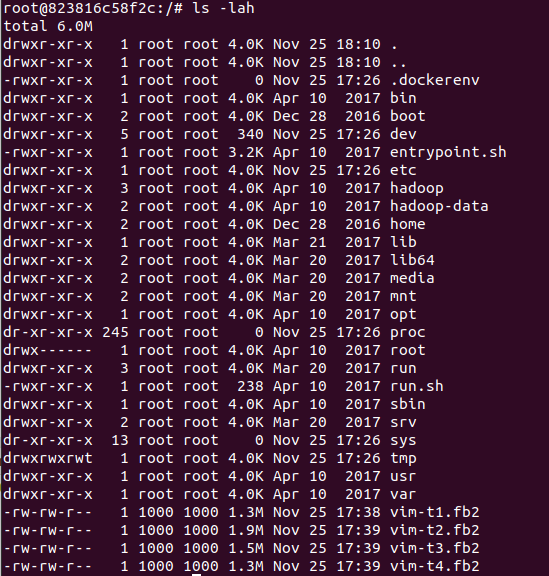
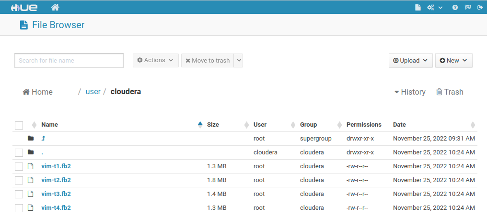
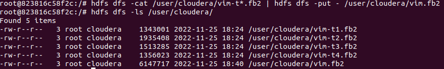
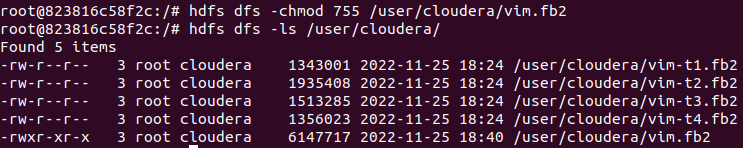
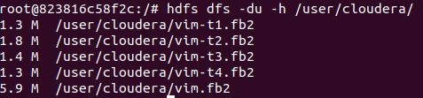
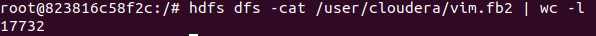

Для выполнения задания необходимо копировать репозиторий [docker-hadoop-spark-workbench](https://github.com/big-data-europe/docker-hadoop-spark-workbench).

Запуск контейнеров:

``` bash
docker-compose up -d
```

Определение ID контейнера Datanode:
``` bash
docker ps
```

Копирование файлов в контейнер Datanode:
``` bash
docker cp ../vim-t1.fb2 823816c58f2c:/
docker cp ../vim-t2.fb2 823816c58f2c:/
docker cp ../vim-t3.fb2 823816c58f2c:/
docker cp ../vim-t4.fb2 823816c58f2c:/
```

Подключение к контейнеру Datanode:
``` bash
docker exec -it 823816c58f2c /bin/bash
```

Вывод информации о содержащихся в контейнере файлах:
``` bash
ls -lah
```


Перенос файлов на HDFS:
``` bash
hdfs dfs -copyFromLocal vim-t* /user/cloudera/
```


Объединение всех томов в один файл:
``` bash
hdfs dfs -cat /user/cloudera/vim-t*.fb2 | hdfs dfs -put - /user/cloudera/vim.fb2
```


Изменение прав доступа к файлу:
``` bash
hdfs dfs -chmod 755 /user/cloudera/vim.fb2
```


Вывод информации о размере файлов:
``` bash
hdfs dfs -du -h /user/cloudera/
```


Изменение фактора репликации для файла:
``` bash
hdfs dfs -setrep -w 2 /user/cloudera/vim.fb2
```

Подсчет количества строк в файле:
``` bash
hdfs dfs -cat /user/cloudera/vim.fb2 | wc -l
```

